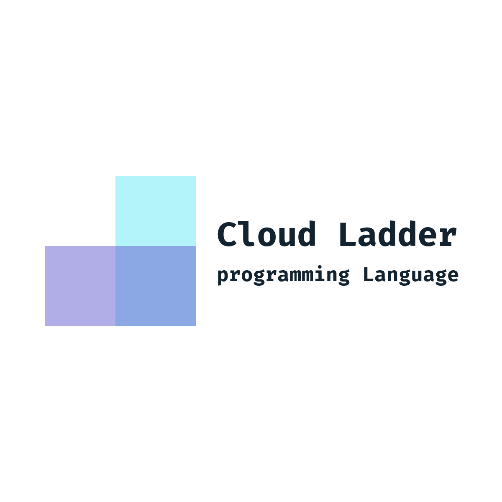

# Current State of Cloud Ladder

[github.com/BIT-SYS/cloud-ladder](https://github.com/BIT-SYS/cloud-ladder)


---





---

## 我们是谁

---

|  <!-- .element height="50%" width="50%" -->| <!-- .element height="50%" width="50%" -->|
|:-:|:-:|
|YHR|[FKY](https://blog.fkynjyq.com)|

---

## 提纲

- 我们目前的成果
- 什么是 Cloud Ladder
- Cloud Ladder 语言设计
- Cloud Ladder 语言实现

*内容以分享经验心得为主*

---

## 我们做了什么

--

### 一个新语言的诞生:
## [Cloud ladder](https://github.com/BIT-SYS/cloud-ladder)

```python
print("Hi, Cloud Ladder!")
```

--

它包括：

- [x] 一份~~不完整的~~规范
- [x] 一个~~不太好用的~~解释器
- [x] 一堆~~零散的~~文档

--

## 里程碑

- 三月初：项目开始，首先进行语言设计。
- 三月十五日：第一份 commit，开始进入代码实现。
- 四月十八日：语义分析分支出现，语法设计的实现完成。
- 四月二十日：IR 分支出现，AST 设计实现已经基本完成。
- 五月七日：IR 基本完成，开始进行解释器部分实现。
- 五月二十一日：加入 AI 的调用。
- 五月二十三日：结束 alpha 版本工作。

--

## Cloud Ladder 目前支持什么功能

- 类型
  - 基本类型
  - 列表
  - 多媒体类型
- 基本功能
  - 变量定义
  - 控制语句
  - 函数定义
  - 函数调用
  - 静态分析
  - 内置基本函数
- 嵌入 Java 编写的代码
- AI 支持的多媒体类型转换

---

## 什么是 Cloud Ladder

--

## 特点

- 面向云计算
- 内置 AI 支持 
- 面向教学
- GPL-3.0 许可证

--

## 架构

- 解释型语言
- 静态类型语言
- 强类型语言
- 基于 ANTLR4
- 基于 Java
- 基于 Gradle 进行构建

---

## 快速上手

--

## 代码仓库都包含什么？

- 目录结构
- 持续集成（CI）

--

- 运行代码
- 使用 Gradle 进行单元测试
- 生成调试信息

---

## Cloud Ladder 语言设计

--

## 为什么使用静态强类型的类型设计

- 强类型 
    - 更加可读的代码，无歧义的行为
        - 反例：JS, C
- 静态类型
    - 提供更多编译期检查和优化的可能
        - 比如 TypeScript、Rust、Python type hint
    - 提供类型推导的可能
        - 通过语言插件大幅提高编程体验


--

## For 循环

- `for i in j` 取代直接迭代
- 更贴近高级语言和函数式编程
- 后续可以支持迭代器
    - 比如 Python List Comprehension、Java Stream


--

## 类型系统

- 简单
- 正交
- 可扩展
  - 组合
  - 继承

--

- 不追求精度，因此合并 float 与 int
- 支持流媒体类型
    - 采用机器学习接口帮助类型进行转换


--

## `NULL` 类型 

--

- 程序设计永远的痛
- 希望通过类型系统绕过 void 这个坑
- 但是目前只能采用鸵鸟方法


--

## 继承与接口的考量

--

- [都是 OOP 的体现](https://stackoverflow.com/a/5816589/8788076)
- 继承比较贴合用户习惯
- 接口的设计可以提供更灵活的组合
  - inheritance mixes orthogonal concepts (code reuse and subtyping) 
  - and does not allow fine grain control over which part of the superclass interface is inherited.

> Inheritance describes an is-a relationship.
<br> Implementing an interface describes a can-do relationship.

--

## `variable.func()` 语法糖

--

众所周知，调用对象的方法其实只是把对象本身作为第一个参数调用函数。因此定义 A 的方法时也没必要写在 class A 的代码块中，直接定义第一个参数为 A 类型的函数即可。

允许通过点操作符向函数第一个形参传入实参的方式被称为统一函数调用语法（UFCS），这种语法让函数链接看起来更加清楚，例如 `a().b().c()` 就可以表示 `c(b(a()))`。

--

不过 Cloud Ladder 并没有采用完全体的 UFCS ，我们规定只有第一个参数的名字为 self 时才能作为方法被调用。这样有助于帮助使用者规定自己定义的到底是方法还是函数。

--

## 默认返回

函数中没有 return，返回最后一句表达式的返回值。

不过如前文所说，在类型系统不够完善的当下使用起来像鸵鸟。

--

## 去除多余的 `()`

Cloud Ladder 从最初起就规定了使用大括号表示代码块，if/for/while 等语句的条件部分必定紧跟着“{”，在关键字与大括号之间再加一对小括号实属多余，所以我们删去了多余的括号。

---

## Cloud Ladder 语言实现

--

## ANTLR

--

语法最初的设计是计老师完成的，他要求变量声明时类型要放在变量名前面、用大括号表示代码块。

我们在其上做了些补充，比如用 elif 代替 if else、以换行符结尾等。最后的语法类似于 Java 和 Kotlin 的合体，因此我们以 Java 的 EBNF 描述为底，修改后完成了 Cloud Ladder 的语法描述。匿名函数的写法由F补充，来自 Rust（Rust 借鉴的 Haskell 和 SML）。

--

## AST 设计与实现

--

- 使用 Visiter
- 尽量提供代码复用的支持
- 为了传递更多的信息，AST 节点指向 ParserContext 节点



--

## 静态分析

--

编译器的前端有两个检查：符号检查、类型检查。

- 符号检查

  符号检查阶段建立符号表，可以检查未定义的变量和函数，不在 for/while 中的 break 或 continue。

  符号表支持嵌套，代码块内的变量可以遮盖块外的变量。支持函数重载，通过 name mangling 实现。

- 类型检查

  因为语法要求写出变量类型与函数的参数类型、返回值类型。所以类型检查只需遍历一遍 AST，从底端向上传递类型，在特殊节点（如函数调用、列表生成、加法等）检查涉及类型是否符合要求即可。

--

## IR 设计与实现

--

IR 最早来自于龙书上的示例，但是龙书的例子比较简单。我们在原有的基础上为 AST 节点
增加了可复用的代码，然后定义了 IR。

在这一步，AST 和 IR 是非对称的映射。

--

为了给后续的执行提供支持，IR 的设计还需要考虑到：

- 如何使用标签解决跳转问题
- 如何传递标签
- 如何获得下一个执行语句
- 如何记录额外信息

--

## 解释器实现

--

解释器的难点主要在于设计运行时的环境。比如：

- 数据结构如何存储
- 函数和变量的调用栈如何设计
- 如何满足 break 这种需要弹出多个栈元素的 IR
- 如何内嵌 Java 代码

--

## AI 模型接口

--

目前多媒体类型只支持图片，内部使用 byte[] 存储。

相关函数作为内部实现，使用 Java 编写。

目前只支持调用百度的模型。但考虑到未来要适配自定义模型或其他供应商的模型，所以没有引入百度 SDK。与模型间的交互使用 HTTP POST 请求完成。

---

## 暂时的遗憾（目前还不能支持的功能）

- 函数式编程支持
  - 闭包
  - 函数是一等公民
- 语言支持
  - VSCode Language Plugin
- 工程化的编程体验
  - 没有导入包相关的语法

---

## 致谢

- 感谢计卫星老师这个学期以来对我们提供的支持和帮助
- 感谢可靠的队友

---

## 参考资料

[编译原理 / Alfred V. Aho 等 / 机械工业出版社](https://book.douban.com/subject/3296317/)

[ANTLR 4 权威指南 / Terence Parr / 机械工业出版社](https://book.douban.com/subject/27082372/)

[编程语言设计模式 / Terence Parr / 华中科技大学出版社](https://book.douban.com/subject/10482195/)

[Crafting Interpreters / Bob Nystrom](https://craftinginterpreters.com/)

[Java 的 ANTLR 4 语法描述](https://github.com/antlr/grammars-v4/tree/master/java/java)

[Kotlin 语法描述](https://kotlinlang.org/docs/reference/grammar.html)

