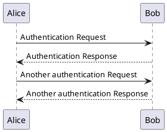

# Current State of Cloud Ladder

---

## Who's Speaking

---

|  <!-- .element height="50%" width="50%" -->| <!-- .element height="50%" width="50%" -->|
|:-:|:-:|
|YHR|FKY|

---

[](https://mermaid-js.github.io/mermaid-live-editor/#/edit/eyJjb2RlIjoiZ3JhcGggVERcbiAgQVtDaHJpc3RtYXNdIC0tPnxHZXQgbW9uZXl8IEIoR28gc2hvcHBpbmcpXG4gIEIgLS0-IEN7TGV0IG1lIHRoaW5rfVxuICBDIC0tPnxPbmV8IERbTGFwdG9wXVxuICBDIC0tPnxUd298IEVbaVBob25lXVxuICBDIC0tPnxUaHJlZXwgRltmYTpmYS1jYXIgQ2FyXVxuXHRcdCIsIm1lcm1haWQiOnsidGhlbWUiOiJkZWZhdWx0In19)


---

## What's this Presentation About.

[TOC]

---

## What Have We Done

--

### Annoucing a new language:
## Cloud ladder!

```python
print("Hi, Cloud Ladder!")
```

- [x] specification
- [x] interpreter
- [x] document

--

## MileStone




TODO

---

## What Is Cloud Ladder

--

## feature

- cloud native
- Builtin AI support
- GPL-3.0 License

--

## architecture

- interpret language
- static type
- strong type
- based ANTLR4
- based on java

---

## Quick Start

--

code repo

- workspace structure
-  CI
- release

--

- run demo
- test with gradle
- debug info

---

## Programming Language Design

--

## Why use strong and static type

--

## for loop

--

## type system

--

## null type

--

## Inherit vs Interface

--

## `variable.func()` sugar syntax

--

众所周知，调用对象的方法其实只是把对象本身作为第一个参数调用函数。因此定义A的方法时也没必要写在class A的代码块中，直接定义第一个参数为A类型的函数即可。允许通过点操作符像函数第一个参数传参的方式被称为统一函数调用语法（UFCS），这种方式似的连续调用函数的代码看起来更清楚c(b(a()))→a().b().c()，而且也有助于封装。

--

不过Cloud Ladder并没有采用完全体的UFCS，我们规定只有第一个参数的名字为self时才能作为方法被调用。这样有助于帮助使用者规定自己定义的到底是方法还是函数。

--

## default return

函数中没有return，返回最后一句表达式的返回值
那for/if呢？？

--

## remove  useless ()
因为Cloud Ladder从最初起就规定了使用大括号表示代码块，所以if/for/while等语句的条件部分必定紧跟着`{`，在其中再加一层小括号实属多余，所以我们删去了多余的括号。

---

## Programming Language Implementation

--

## ANTLR

--

语法最初的设计是计老师完成的，他要求变量声明时类型要放在变量名前面、用大括号表示代码块。我们在其上做了些补充，比如if-elif-else、以换行符结尾等。最后的语法类似于java和kotlin的合体，因此我们以java的EBNF描述为底，删除了很多不必要的语法（如类的定义），结合了一部分kotlin语法。匿名函数的写法由F补充，来自 Rust（Rust 借鉴的 Haskell 和 SML）。

--

## AST

--

- 使用 Visiter
- 尽量提供代码复用的支持
- 为了传递更多的信息，AST 节点指向 ParserContext 节点

```mermaid
todo: 表示类关系的设计
```

--

## Static Analysis

--

编译器的前端有两个检查：符号检查、类型检查

符号检查阶段建立符号表，可以检查未定义的变量和函数，不在for/while中的break和continue
符号表支持嵌套，代码块内的变量可以遮盖之外的变量。支持同名而参数类型不同的函数，通过name mangling实现

因为语法要求写出变量类型与函数的参数类型、返回值类型。所以类型检查阶段只是从语法树底端向上传递类型，在特殊节点检查类型是否符合要求即可(比如[a..b]需要ab都为Number类型)

--

## IR

--

IR 最早来自于龙书上的示例，但是龙书的例子比较简单。我们在原有的基础上为 AST 节点
增加了可复用的代码，然后定义了 IR。

在这一步，AST 和 IR 是非对称的映射。

--

为了给后续的执行提供支持，IR 的设计还需要考虑到：

- 如何使用标签解决跳转问题
- 如何传递标签
- 如何获得下一个执行语句
- 如何记录额外信息

--

## Interpreter

--

Interpreter 的难点主要在于设计运行时的环境。比如：

- 数据结构如何存储
- 函数和变量的调用栈如何设计
- 如何满足 break 这种需要弹出多个栈元素的 IR
- 如何内嵌 Java 代码

---

## What We Haven't Support Yet

---

## Roadmap
